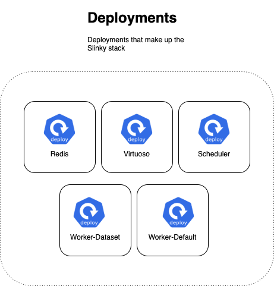
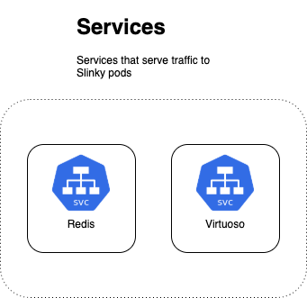
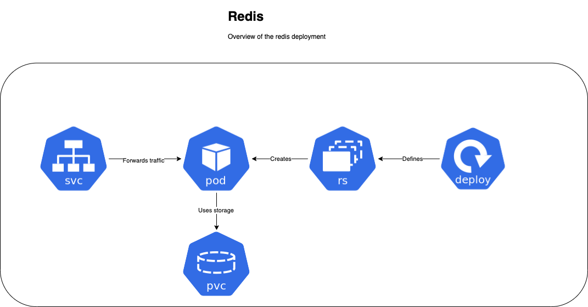
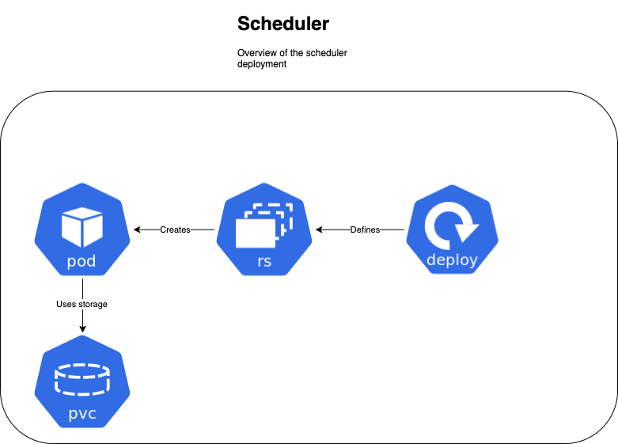
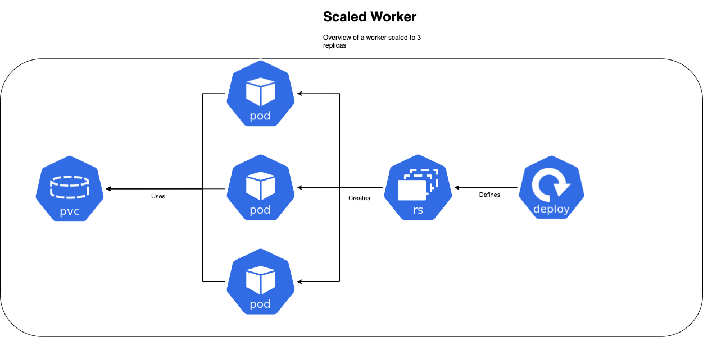

# Kubernetes Architecture

At a high level, the Slinky stack is a collection of five deployments and two services shown below.

## Deployments

In general, the deployments in Slinky are all very similar, which should be visually clear in the architecture diagrams below.

### With Services

These deployments need to accept connections from other applications, which might be end users _or_ other applications in the stack. Because of this requirement, these deployments are associated with a service.

### Without Services

These deployments don't handle traffic from external applications, hence the deployment diagrams are without services. 

When a worker deployment is scaled, the vertical scaling is evident in the following diagram which shows a worker deployment with a replica count of 3.

## Filesystem Artifacts

All of the Slinky deployments use a single volume claim which has space allocated on the CephFS system, shown below.

